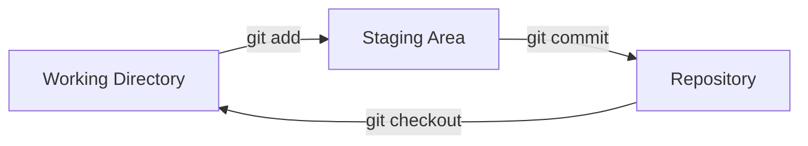

## Step 2: 创建你的第一个仓库

现在我们已经熟悉了这个示例项目，并且告诉了 Git “你是谁”，接下来就让我们开始把游戏纳入版本控制吧！

### 📖 理论: Git 工作流

Git 的工作流涉及三个主要区域：

- **Working Directory（工作目录）**: 你正在修改项目文件的地方，也就是你在电脑里能看到的目录。
- **Staging Area（暂存区）**: 一个临时存储区域，用于存放你准备提交的修改。
- **Repository（仓库）**: 仓库区（或版本库），存放你提交的修改的永久记录。



### 重要的 Git 命令

Git 有很多操作，对于本地仓库，最常用的命令有下面这些。

- `git init` - 初始化一个新的仓库，以启用版本控制。
- `git add` - 将相关的修改添加到暂存区，为"提交"到历史记录做准备。
- `git commit` - 保存或"提交"暂存区中的修改到项目的历史记录中。
  - commit message - 对修改的简短描述，以帮助保持历史记录的条理清晰。
- `git status` - 查看工作目录和暂存区的当前状态。
- `git checkout` - 将工作目录切换到仓库历史中的某个版本。

> [!TIP]
> 提交信息很重要！简洁、清晰、描述性的提交信息能让你的项目历史更容易理解（并帮助你找到未来的 bug）！

### ⌨️ 实操练习: 初始化项目仓库 (使用命令行)

下面我们来给这个游戏项目加上版本控制，并提交当前版本。

1. 首先，在终端中，切换到项目所在目录。

   ```bash
   cd /workspaces/stack-overflown
   ```

1. 初始化 Git 仓库。

   ```bash
   git init
   ```

1. 检查一下仓库的状态。注意这里提示 "No commits yet"（暂无提交），并提醒你使用 `git add` 命令。

   ```bash
   git status
   ```

   

1. 将游戏文件添加到暂存区。这会创建一个锁定副本，为将它们提交到仓库历史做准备。

   ```bash
   git add src/index.html
   git add src/index.js
   git add src/patterns.js
   git add src/style.css
   ```

   或者

   ```bash
   git add src/*
   ```

1. 再次检查仓库状态。注意每个文件都被标识为 `new file`。

   ```bash
   git status
   ```

   

1. 提交修改到仓库历史。我们的项目历史就这样开始啦! :octocat:

   ```bash
   git commit -m "Initial commit"
   ```

   

1. 再次检查仓库状态。此时提示 "working tree clean"（工作目录干净），这意味着当前的工作副本与仓库历史完全一致。

   ```bash
   git status
   ```

   

### ⌨️ 实操练习 2: 使用 IDE 添加文件

接下来，我们尝试用 IDE 来添加文件。

1. 在文件浏览器中，单击 **New File...** 图标，开始创建 `README.md` 文件。确保它位于 `./stack-overflown/` 文件夹内。

   ```txt
   README.md
   ```

   

1. 打开文件并插入以下内容。

   ```md
   # Stack Overflown

   Organize the falling blocks into the current debug pattern before the stack overflows! ⏳
   ```

1. 在左侧导航栏中，选择 **Source Control** 选项卡。注意 `README.md` 文件显示在 **Changes**（变更）区域。

   

1. 将文件提升到暂存区，方法是鼠标悬停在文件上并选择加号 `+` 按钮。

   

1. 输入提交信息，然后按 **Commit** 按钮。

   ```txt
   Start game documentation
   ```

   

1. 对于第二个提交，还将以下内容添加到 `README.md` 中。

   ```md
   ## How to Develop

   - `index.html` - the game container for playing
   - `index.js` - the primary game logic
   - `patterns.js` - the error patterns to match during gameplay
   - `style.css` - the game formatting and styling
   ```

1. 将变更添加到暂存区，并使用以下消息提交。

   ```txt
   Start developer docs
   ```

   

1. 提交完成后，Mona 会开始检查你的作业。请稍等片刻，她会在评论中回复进度与下一步任务。

<details>
<summary>遇到问题？🤷</summary><br/>

- 如果 `git status` 显示错误的文件，可以使用 `git restore --staged <filename>` 将它们从暂存区中移除。

</details>
