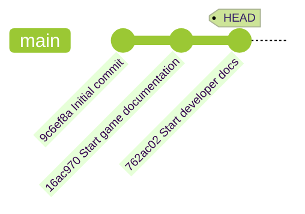

## 步骤 3：探索 Git 历史记录

现在我们的游戏已经由 Git 跟踪，让我们学习如何探索都做了哪些更改、何时做的以及由谁做的。

### 📖 理论: 理解 Git 历史记录

Git 会通过提交(commit)来维护项目的完整历史记录。每次提交都包含以下内容：

- **唯一哈希 ID**: 一个唯一的标识符，方便在历史记录中引用。
- **父提交**: 对前一个提交的引用，形成链条。
- **作者信息**: 谁做的修改。
- **时间戳**: 更改应用的时间。
- **提交消息**: 包含在该提交中所做更改的描述。

此外，`HEAD` 指针是一个特殊的标签，指示你在项目历史中的当前位置。你的项目结构大概如下图所示。



### 重要的 Git 命令

每个人查看历史记录的方式不同，社区也创建了许多可选项。
这里列出了一些你将来经常会用到的常用命令和选项。

- `git log` - 显示项目的详细历史记录。
  - `git log --oneline` - 每行一条提交，信息更精简。
  - `git log --graph` - 以可视化的图表形式显示提交历史，这对于分支较多的情况很有帮助。
- `git checkout` - 切换到历史记录中的不同时间点（会修改工作目录中的文件）。

### ⌨️ 实操练习 1: 探索历史记录（使用命令行）

1. 显示详细的提交历史记录。

   ```bash
   git log
   ```

   

1. 以单行形式显示每个提交。

   ```bash
   git log --oneline
   ```

   

1. 以可视化的图表形式显示完整的提交历史记录。

   ```bash
   git log --graph --oneline
   ```

   > 🪧 **Note**: This will look more interesting in a future step when the history is longer.

1. 复制 `Initial commit` 条目的 **Commit ID**。长短格式均可用。

1. 使用它切换到早期的版本。

   ```bash
   git checkout <commit id>
   ```

   <br/>

   🪧 注意：`README.md` 文件已被移除。
   
   

1. 切换回 `main` 上的最新提交。注意 `README.md` 文件又回来了。 🧐

   ```bash
   git checkout main
   ```

   <br/>

   

### ⌨️ 实操练习 2: 探索历史记录（使用 VS Code）

1. 在左侧导航栏中，打开 **Source Control**（源代码管理）选项卡。

1. 右键单击 **Changes**（变更）标题并选择 **Graph**（图表）选项。

   

1. 检查 **Graph**（图表）面板。注意最近提交的时间线列表。

   <br/>

1. 点击提交名称，展开该提交修改过的文件列表。

   

1. 探索完 Git 历史记录后，Mona 应该已经在检查你的作业了。给她一点时间，继续关注评论。你将看到她回复进度信息和后续步骤。

<details>
<summary>遇到问题了？🤷</summary><br/>

- 使用 `git log --help` 查看所有可用的历史记录查看选项。

</details>
