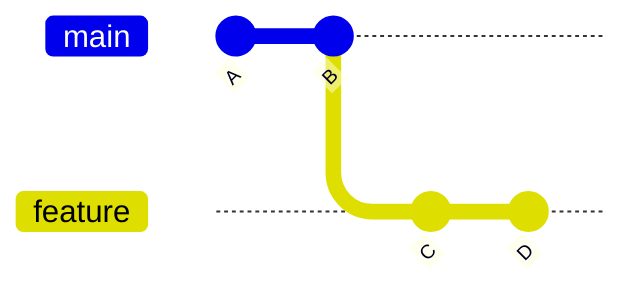
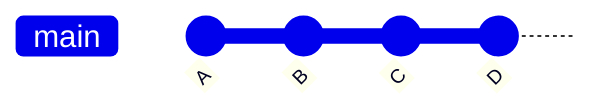
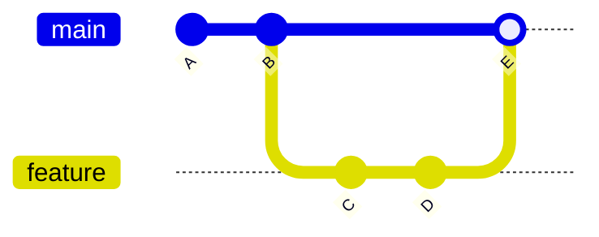
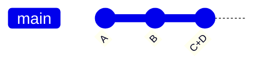

## Step 5: 使用分支进行协作

现在游戏已经被 Git 跟踪了，我们知道可以轻松地回退到某个可用的版本。而且，既然我们能在提交历史中看到确切的变更内容，就能确保不会把不相关的改动带进去。

但是，这又引发了一些新的疑问！ 😱

"如何保持提交历史的整洁？"

"如何避免在历史记录中留下未完成版本的痕迹？"

"如果我需要同时处理多个功能或修复怎么办？"

### 📖 理论：理解分支

在 Git 中，分支（Branches）本质上是指向特定提交的轻量级指针（类似于标签）。这使得我们可以在不影响原始版本的情况下，基于某个版本进行开发，非常适合并行开发新功能或修复 Bug。

核心概念：

- **`main` 分支**: 通常代表可信的、可用的工作版本，也是最开始创建的分支。（在旧版本中常被称为 `master`）
- **Feature Branch (功能分支)**: 一个安全、独立的工作空间，用于开发新功能而不影响主版本。
- **Merging (合并)**: 将不同分支的变更合并到一起。

### 有哪些常用的分支合并策略？

不同的合并策略适用于不同的协作场景。下面介绍几种最常见的合并方式，它们各有侧重，可以根据项目的实际需求来选择。

**Fast-forward merge (快进合并)**: 直接将子分支上的新提交移动到父分支上。

<div align="center">

**合并前:** 原始状态



**合并后:** 快进合并



</div>

**合并提交(Merge commit)**: 在父分支上创建一个新的合并提交，将子分支的变更合并进去。这会保留子分支的完整历史记录，便于追溯。

<div align="center">

**合并前:** 原始状态


**合并后:** 合并提交



</div>

**Squash merge(压缩合并)**: 将一个分支上的多个提交压缩成一个新的单一提交合并到另一个分支上。

<div align="center">

**合并前:** 原始状态


**合并后:** 压缩合并



</div>

### 常用的分支命令

- `git branch my-new-feature` - 创建一个新分支。
- `git checkout my-new-feature` - 切换到另一个分支。
- `git merge` - 将一个分支合并到另一个分支。（默认：快进合并）

> [!TIP]
> 你可以使用 `git reset --soft HEAD~1` 来撤销上一个提交。在 VS Code 中，可以使用命令面板搜索 `Undo Last Commit`。

> [!TIP]
> Git 2.23 引入了 `git switch` 命令来简化分支管理。你会在未来看到它被更频繁地使用。

<!-- Since Git 2.23 -->
<!-- `git switch --create <branch name>` -->
<!-- `git switch branch-name` -->

### ⌨️ 实操练习 1: 在分支上提交 (使用命令行)

下面我们来创建一个分支，练习在上面提交改动。

1. 首先，让我们看看提交历史。注意它是完全线性的（还没有分支）。

   ```bash
   git log --all --graph --oneline
   ```

   

1. 创建一个新分支并切换到该分支。

   ```bash
   git branch fix-incomplete-high-score
   git checkout fix-incomplete-high-score
   ```

1. 显示所有可用分支。

   ```bash
   git branch --list
   ```

   

1. 打开 `index.js`，我们来把最高分功能修好。

1. 在 `line 41`，插入一个用于跟踪最高分的新变量，然后提交。

   ```js
   let highScore = 0;
   ```

   ```bash
   git add src/index.js
   git commit -m "Add new variable for tracking high score"
   ```

1. 在 `line 61`，插入从 local storage 加载分数并提交的代码。

   ```js
   // Load high score from localStorage
   highScore = parseInt(localStorage.getItem("stackOverflownHighScore")) || 0;
   document.getElementById("high-score").textContent = highScore;
   ```

   ```bash
   git add src/index.js
   git commit -m "Add loading of stored high score"
   ```

1. 在 `line 313`，替换 `updateScore` 函数，使其跟踪最高分，然后提交。

   ```js
   function updateScore() {
     document.getElementById("score").textContent = score;

     // Update high score if current score exceeds it
     if (score > highScore) {
       highScore = score;
       document.getElementById("high-score").textContent = highScore;
       localStorage.setItem("stackOverflownHighScore", highScore);
     }
   }
   ```

   ```bash
   git add src/index.js
   git commit -m "Add logic to keep track of highest score"
   ```

1. 让我们再次查看提交历史。注意我们的 feature 分支比 `main` 分支多了 3 个提交，并且我们的 feature 分支用 `HEAD` 标记，明确了当前版本。

   ```bash
   git log --all --graph --oneline
   ```

   

1. 切换回 `main` 分支。

   ```bash
   git checkout main
   ```

1. 合并新功能。

   > 🪧 **注意:** 为了学习效果，我们用了 "non-fast forward" 选项，这样分支在历史中保持可见，让可视化图表看起来更有意思。

   ```bash
   git merge --no-ff fix-incomplete-high-score -m "Fix high score tracker"
   ```

   

1. 再次查看提交历史图。注意我们刚刚合并的分支。

   ```bash
   git log --all --graph --oneline
   ```

   

1. 删除指向该feature 分支的指针/标签，因为它已被合并，不再需要。

   ```bash
   git branch --delete fix-incomplete-high-score
   ```

   > 🪧 **注意:** 这不会删除分支内容，只是删除了用于引用它的名称。

### ⌨️ 实操练习 2: 在分支上提交 (使用 VS Code)

1. 在左侧导航中，打开 **Source Control** 选项卡。确保 **Graph** 面板仍然可见（来自步骤 3）。让我们在应用更改时观察它的更新。

1. 在左下角状态栏，点击分支名称 `main`。一个选项菜单将会出现。

   <br/>

1. 选择 **Create new branch...** 选项并使用下面的名称。

   

   ```txt
   add-level-counter
   ```

   

1. 打开 `index.html`。在 `line 21`，插入一个用于显示当前级别的新元素，然后提交更改。

   ```diff
   <h3>Level</h3>
   <div class="score" id="level">1</div>
   ```

   提交信息

   ```bash
   Add element to display current level
   ```

1. 打开 `index.js`，添加级别计数器。

1. 在 `line 42`，添加 2 个用于跟踪级别的变量，然后提交更改。

   ```js
   let level = 1;
   let patternsCleared = 0;
   ```

   提交信息

   ```bash
   Add variables for level and clear counter
   ```

1. 在 `line 273`，替换 `checkPatternMatch` 方法，然后提交更改。

   ```js
   function checkPatternMatch() {
     for (let startRow = 0; startRow <= ROWS - PATTERN_SIZE; startRow++) {
       for (let startCol = 0; startCol <= COLS - PATTERN_SIZE; startCol++) {
         if (matchesPattern(startRow, startCol)) {
           clearPattern(startRow, startCol);
           score += 100;
           patternsCleared++;
           if (patternsCleared % 5 === 0) {
             level++;
             dropInterval = Math.max(200, 1000 - (level - 1) * 100);
             document.getElementById("level").textContent = level;
           }
           updateScore();
           setNewTargetPattern();
           return;
         }
       }
     }
   }
   ```

   提交信息

   ```bash
   Add logic to calculate level
   ```

1. 注意 **Graph** 面板显示了完整的历史记录：新的提交、先前的分支以及原始的提交。

   

1. 为了准备合并，再次单击分支名称并选择 `main` 分支。

   <br/>

   

1. 单击三个点 (`...`) 菜单，然后选择 `Branch`，再选择 `Merge...`。注意它执行了一次正常的 **Fast Forward** 风格合并。

   <br/>

   <br/>

   

1. 单击三个点 (`...`) 菜单，然后选择 `Branch`，再选择 `Delete Branch...`。

   <br/>

   

1. 两个分支都合并后，Mona 应该会开始检查你的作业。给她一点时间，并关注评论。您将看到她回复进度信息和后续步骤。

<details>
<summary>遇到麻烦了？🤷</summary><br/>

- 如果你分支名拼错了，可以用 `git branch --move 旧名称 新名称` 重命名。

</details>
